# Mockup

Your prelim wireframes are finished and are not being redone. The mockup is what
the app will actually look like: the wireframes painted in, with your real
colours, type, spacing and content.

**This is submitted as images or a PDF.** A written description of a picture
scores in the lowest band, because the thing being asked for is the picture.

### Home

**Desktop**

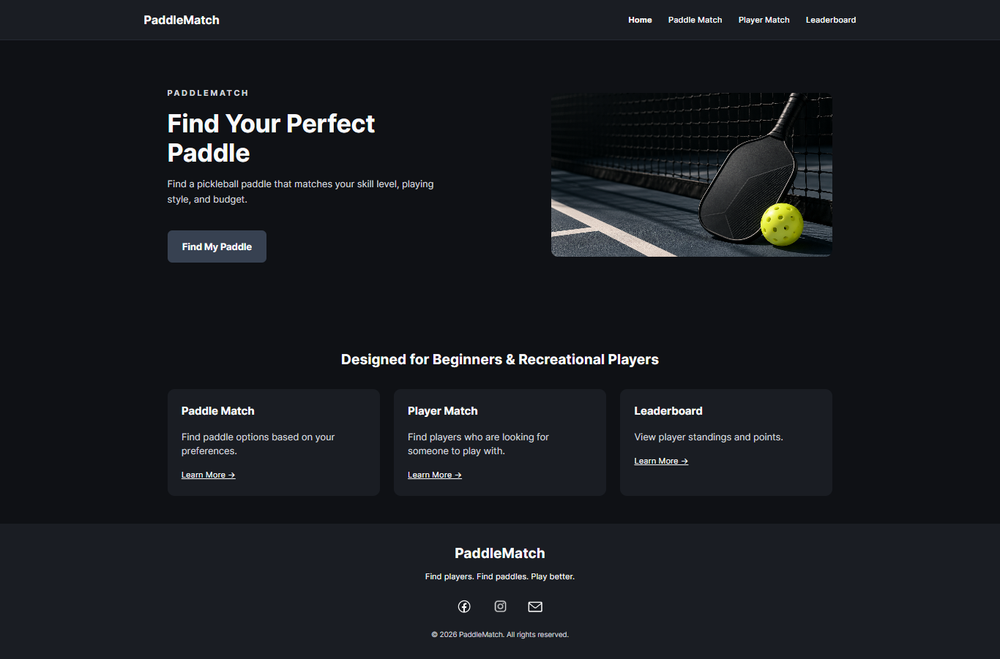

**Phone**

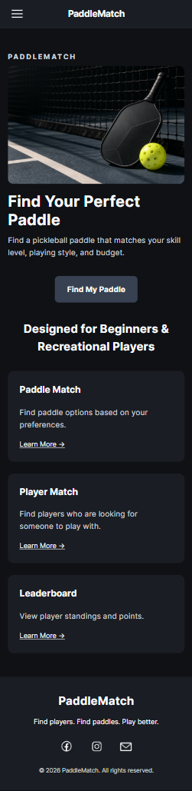

### Login

**Desktop**

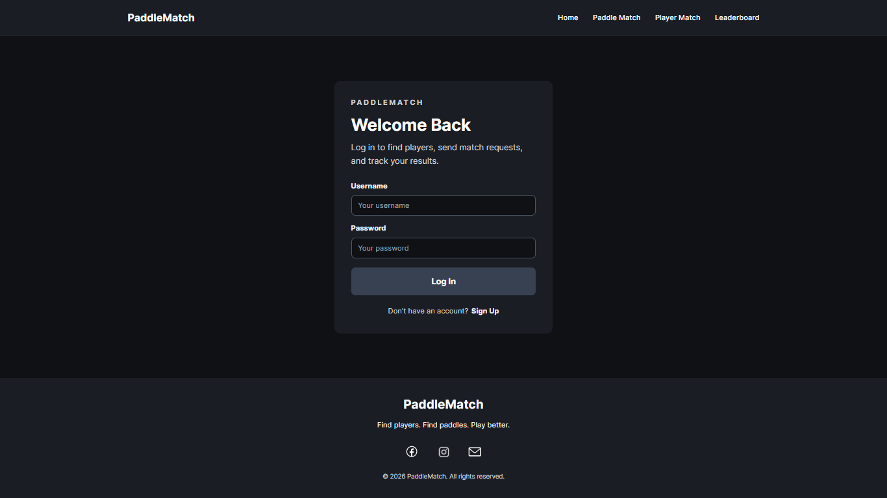

**Phone**

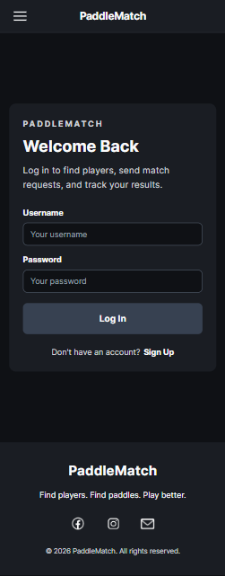

### Sign Up

**Desktop**

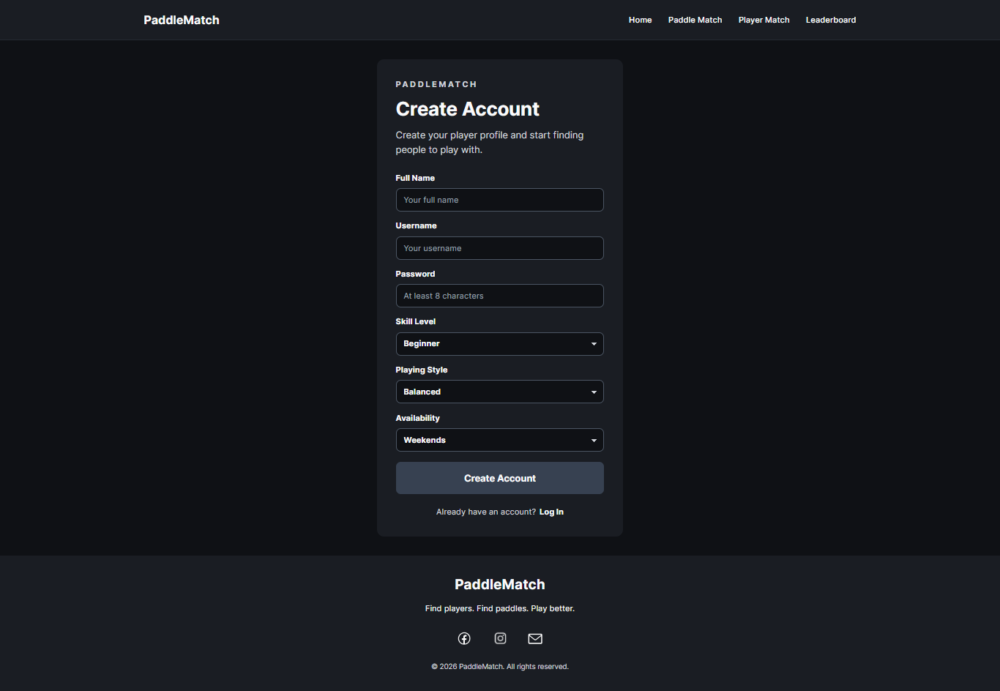

**Phone**

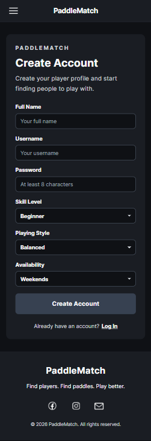

### Paddle Match

**Desktop**

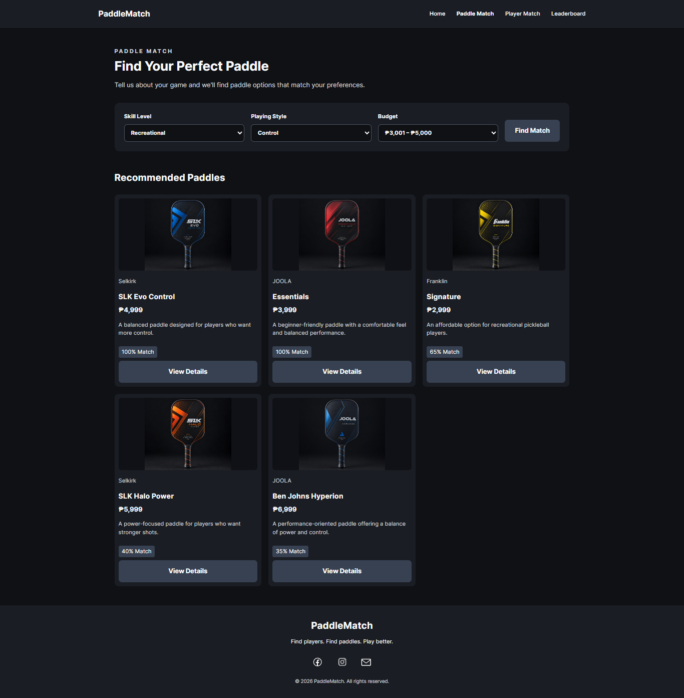

**Phone**

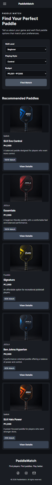

### Paddle Details Modal

**Desktop**

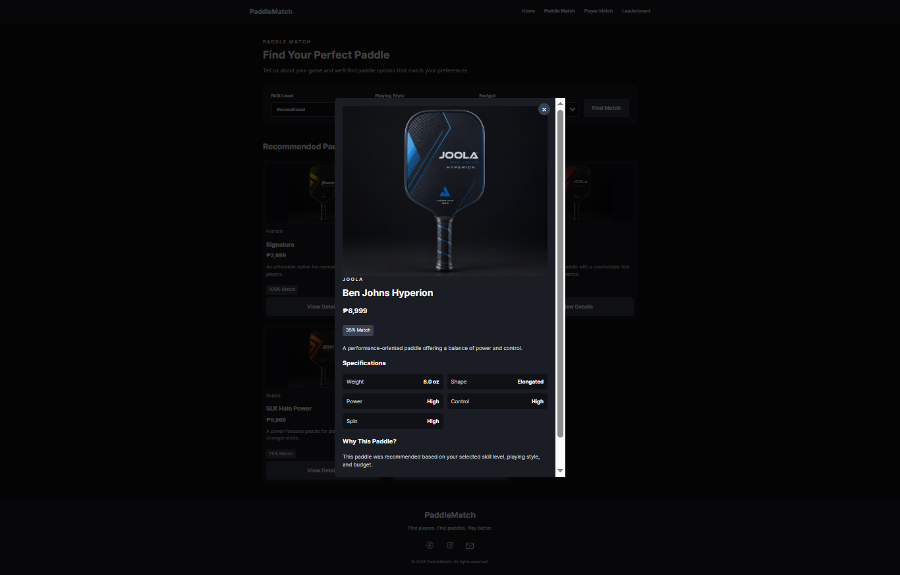

**Phone**

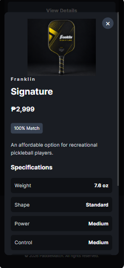

### Player Match

**Desktop**

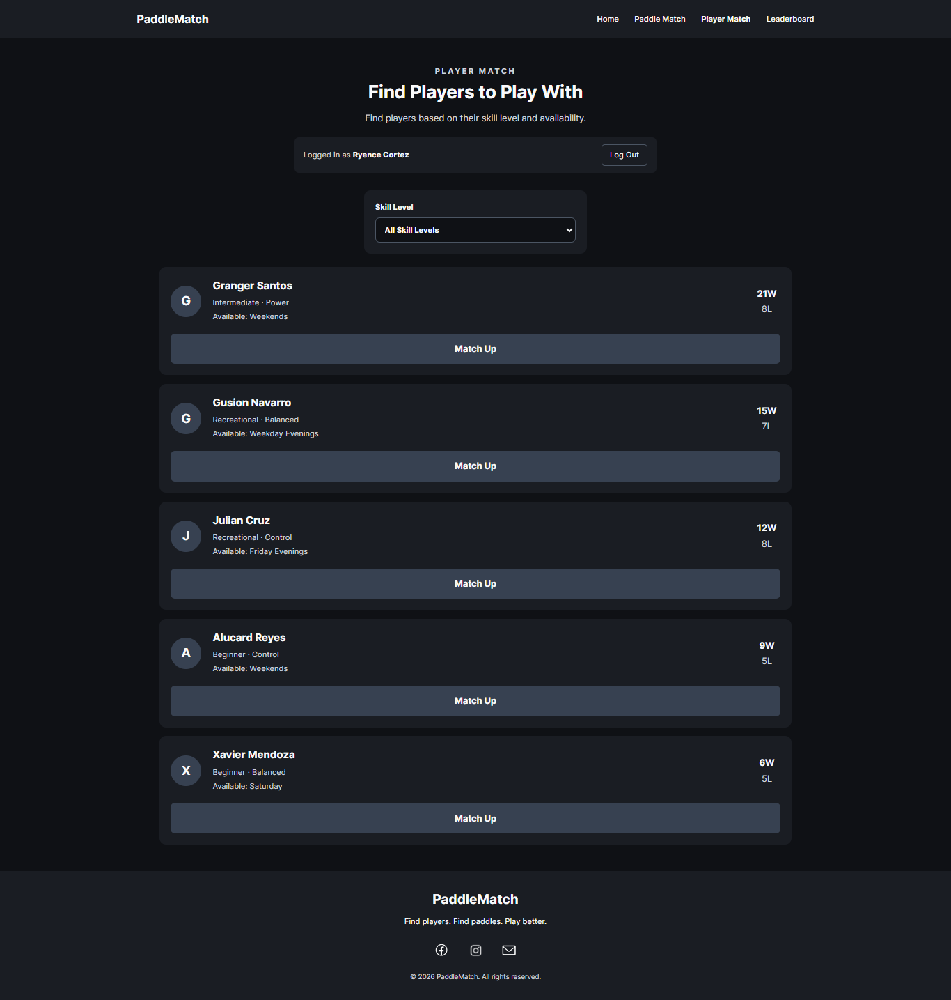

**Phone**

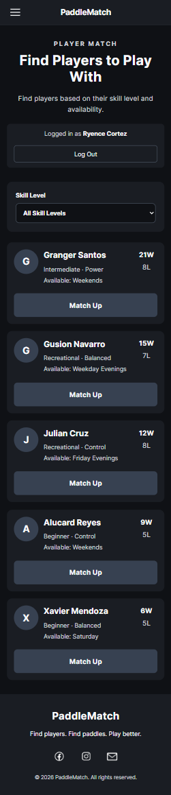

### Player Match — Empty State

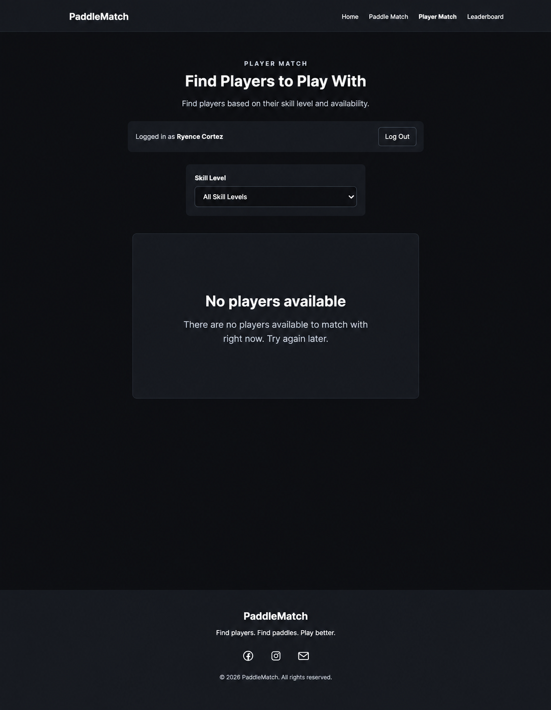

### Leaderboard

**Desktop**

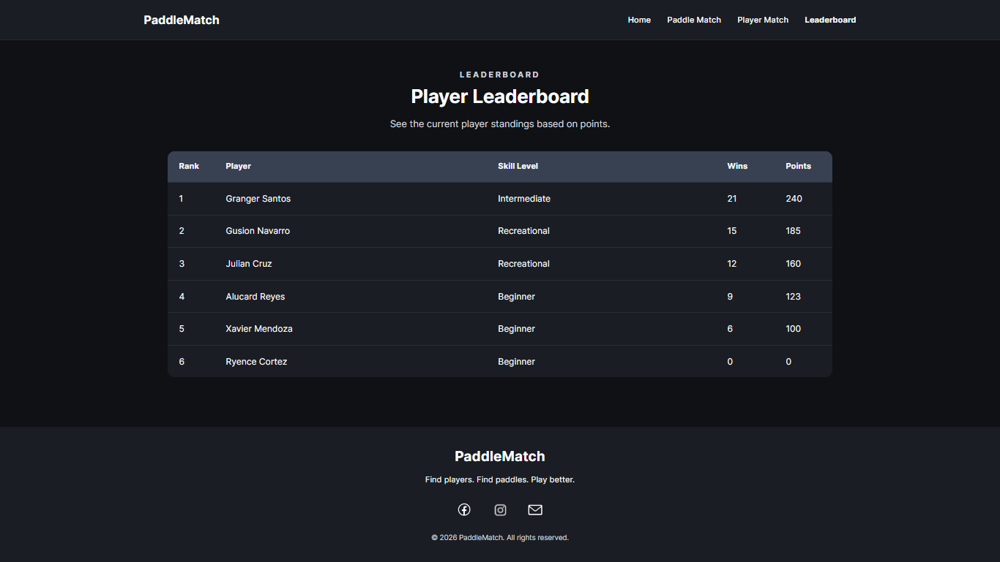

**Phone**

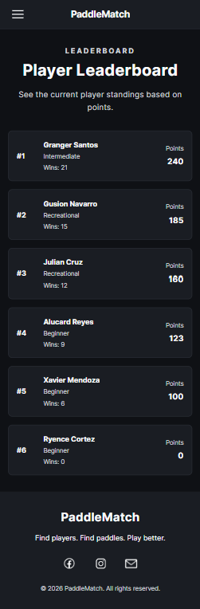

## What it should show

- Every screen in your revised proposal, and no screens that are not in it
- Real content, not "Lorem ipsum" and not "Title here"
- The empty state of at least one screen, because that is the one people forget
- What it looks like on a phone

## Honest note

Anything in the mockup that is not in the built app by the end needs a sentence
in your journal explaining what happened. That is a normal part of building
something, and saying so reads far better than quietly shipping less.
