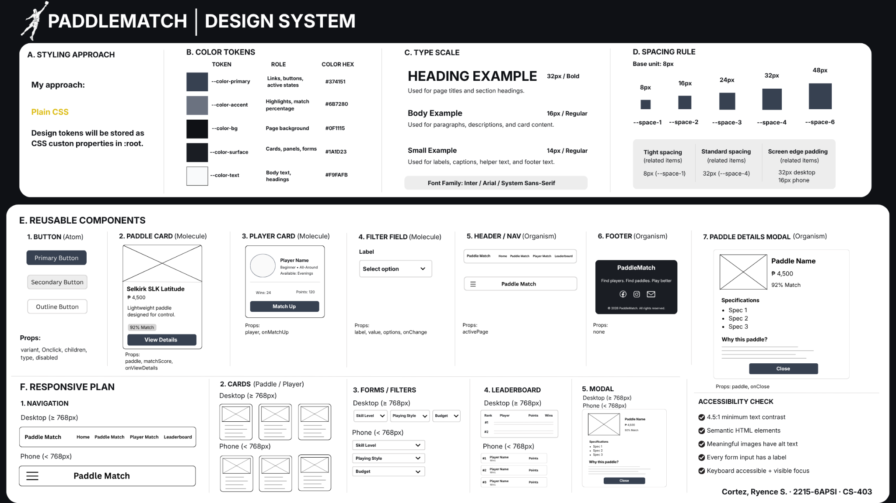

# PaddleMatch Design System



## 1. Styling approach

PaddleMatch uses plain CSS. The main design tokens are stored as CSS custom properties in `client/src/styles.css`.

The interface uses a dark background, dark surface cards, white text, and gray primary/accent colors. The design is kept simple and consistent across the Home, Paddle Match, Player Match, Leaderboard, authentication, and modal interfaces.

## 2. Color tokens

| Token | Role | Hex |
|---|---|---|
| `--color-primary` | Links, buttons, active states | `#374151` |
| `--color-accent` | Highlights and match percentage | `#6B7280` |
| `--color-bg` | Page background | `#0F1115` |
| `--color-surface` | Cards, panels, forms | `#1A1D23` |
| `--color-text` | Body text and headings | `#F9FAFB` |
| `--color-muted` | Secondary text and helper text | `#D1D5DB` |

Additional interface colors used in the CSS include `#4B5563` for button hover states, `#252932` for the header border, and `rgba(0, 0, 0, 0.75)` for the modal overlay.

## 3. Typography

Font family: **Inter, Arial, sans-serif**

| Name | Size | Use |
|---|---:|---|
| Heading | `32px` | Page titles and section headings |
| Body | `16px` | Paragraphs, descriptions, and card content |
| Small | `14px` | Labels, captions, helper text, and footer text |

The Home hero heading uses a larger `42px` size to create stronger visual hierarchy.

## 4. Spacing

Base unit: **8px**

| Token | Value |
|---|---:|
| `--space-1` | `8px` |
| `--space-2` | `16px` |
| `--space-3` | `24px` |
| `--space-4` | `32px` |
| `--space-6` | `48px` |

The same spacing scale is reused for navigation gaps, card padding, form spacing, page sections, and responsive layouts.

## 5. Reusable components

### Button

- Primary button: dark gray filled button using `--color-primary`.
- Secondary button: neutral dark gray button used for secondary actions.
- Outline button: bordered button with a lighter visual treatment.
- Hover: the primary button changes to `#4B5563`.
- Focus: interactive buttons use a visible `2px` outline with `3px` offset.

### Paddle Card

Displays the paddle image, name, brand, price, description, match score, and View Details action. Cards use `--color-surface`, rounded corners, and consistent spacing.

### Player Card

Displays the player's name, skill level, playing style, availability, wins, losses, and Match Up action.

### Filter Field

A labeled select field used for Skill Level, Playing Style, and Budget. Inputs use the dark background, white text, gray border, and rounded corners.

### Header / Navigation

Desktop navigation displays the PaddleMatch brand and page links. On smaller screens, the navigation changes to a menu button and centered page title.

### Footer

Uses the dark surface background and contains the PaddleMatch title, supporting text, social links, email link, and copyright information.

### Paddle Details Modal

Displays the selected paddle's image, name, price, match percentage, specifications, match analysis, and Close action. The modal uses a dark surface panel over a dark overlay.

## 6. Responsive plan

The responsive breakpoint is **768px**.

### Desktop (`>= 768px`)

- Full navigation is displayed.
- Cards are arranged in multi-column grids.
- Forms can display multiple fields in one row.
- The leaderboard uses a table-style layout.
- The paddle details modal uses a wider layout.

### Phone (`< 768px`)

- Navigation changes to a menu button.
- Cards stack into a single-column layout.
- Form filters stack vertically.
- The leaderboard becomes a compact list-style layout.
- The modal uses a narrower mobile layout.

## 7. Component and interface states

| State | Design treatment |
|---|---|
| Default | Dark surface, white text, gray primary elements |
| Hover | Buttons and interactive controls use a lighter gray treatment |
| Focus | Visible `2px` outline with `3px` offset for keyboard accessibility |
| Disabled | Reduced interaction and unavailable actions use the disabled styling implemented by the component |
| Loading | Loading feedback is shown while data or actions are being processed |
| Empty | Empty areas show an appropriate message instead of leaving the page blank |
| Error | API or form errors are shown as user-readable messages |
| Data | Normal populated cards, tables, and lists display the returned information |

## 8. Accessibility

- Normal text is designed to meet the required `4.5:1` minimum contrast ratio.
- Semantic HTML elements are used for navigation, headings, forms, buttons, and inputs.
- Meaningful images use alternative text.
- Form inputs have visible labels.
- Keyboard users have visible focus states on interactive controls.

## 9. In code

The design tokens are implemented as CSS custom properties in `client/src/styles.css`.

The main token structure is:

```css
:root {
  --color-primary: #374151;
  --color-accent: #6B7280;
  --color-bg: #0F1115;
  --color-surface: #1A1D23;
  --color-text: #F9FAFB;
  --color-muted: #D1D5DB;

  --space-1: 8px;
  --space-2: 16px;
  --space-3: 24px;
  --space-4: 32px;
  --space-6: 48px;
}
```

The design system is used as the reference for keeping the visual treatment consistent across the application's pages and reusable components.
